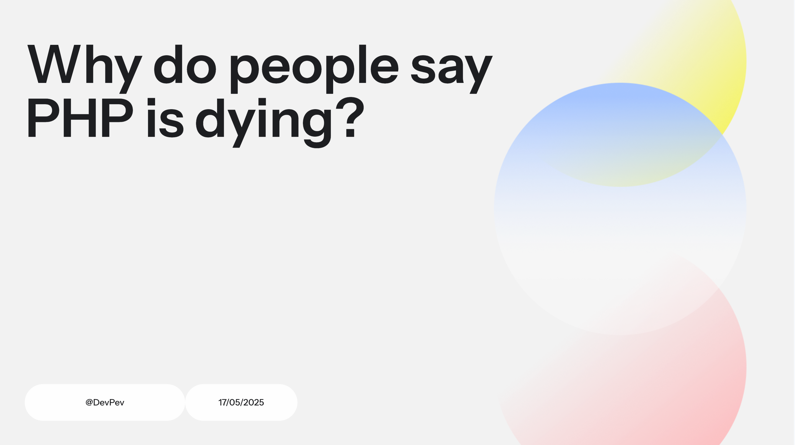
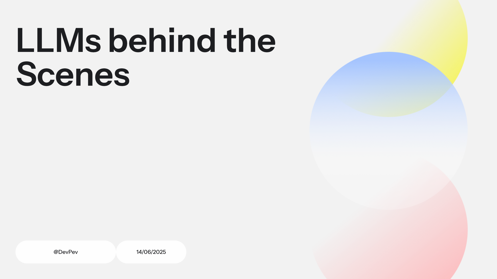
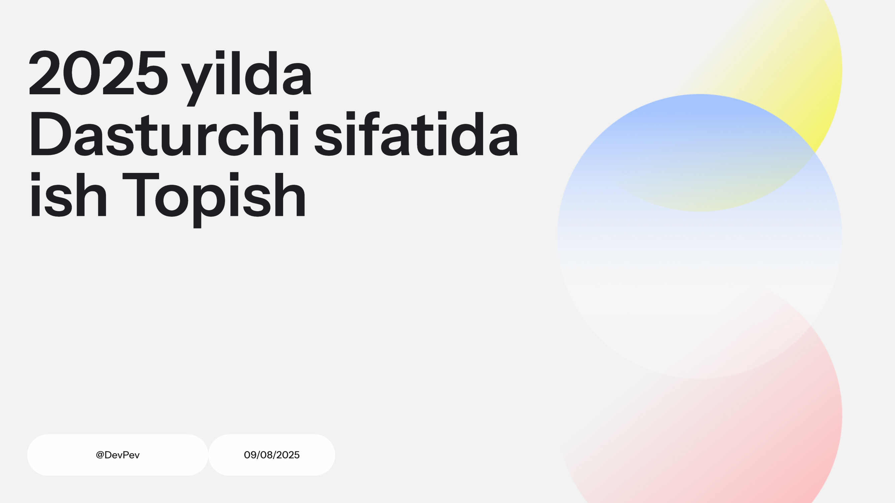

# Talks

## My first ever dev speech!

### Talk given at
- **[DevPev](https://www.linkedin.com/company/devpevuz/)** (May, 2025)

## Diving into the LLMs world

### Talk given at
- **[DevPev](https://www.linkedin.com/company/devpevuz/)** (June, 2025)

## Tips for beginners on their SWE journey

### Talk given at
- **[DevPev](https://www.linkedin.com/company/devpevuz/)** (September, 2025)
